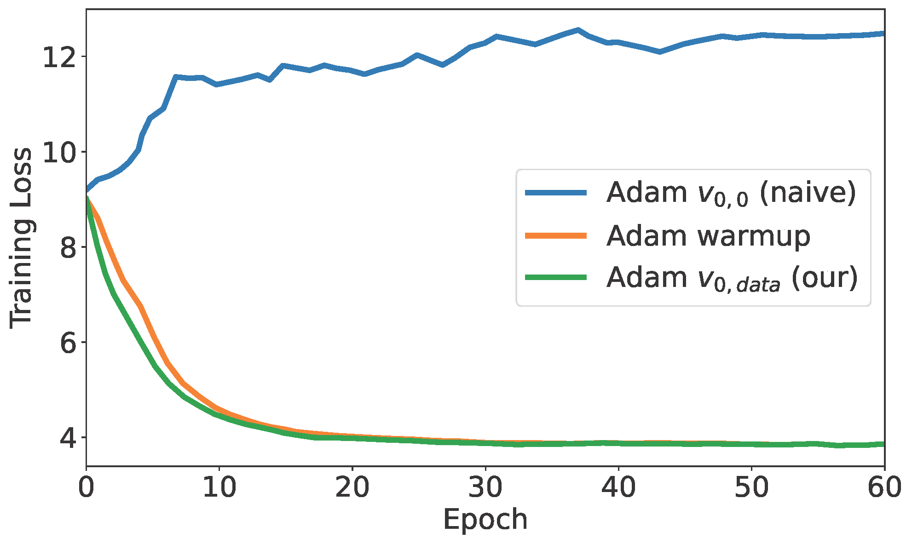
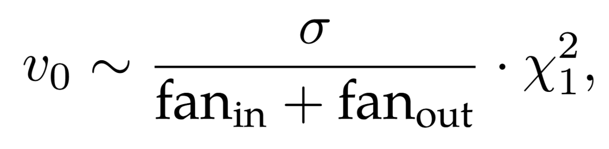
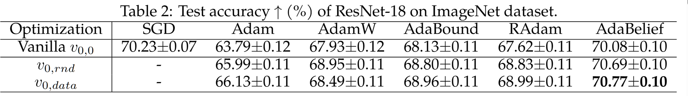
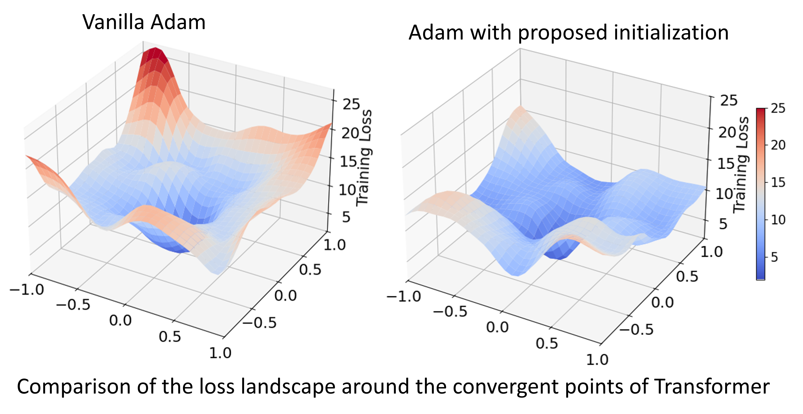

# Revisiting the Initial Steps in Adaptive Gradient Descent Optimization

This repository is for Initialization of Adaptive Gradient Descent Optimizers, introduced in the following paper:
 
Abulikemu Abuduweili and Changliu Liu, [Revisiting the Initial Steps in Adaptive Gradient Descent Optimization](https://arxiv.org/abs/2412.02153), CPAL 2025 in adjunct with OPT 2024.  
 


## Introduction
Adaptive gradient optimization methods, such as Adam, are prevalent in training deep neural networks across diverse machine learning tasks due to their ability to achieve faster convergence. However, these methods often suffer from suboptimal generalization compared to stochastic gradient descent (SGD) and exhibit instability, particularly when training Transformer models.
In this work, we show the standard initialization of the second-order moment estimation ($v_0 =0$) as a significant factor contributing to these limitations. We introduce simple yet effective solutions: initializing the second-order moment estimation with non-zero values, using either data-driven or random initialization strategies. Empirical evaluations demonstrate that our approach not only stabilizes convergence but also enhances the final performance of adaptive gradient optimizers. Furthermore, by adopting the proposed initialization strategies, Adam achieves performance comparable to many recently proposed variants of adaptive gradient optimization methods, highlighting the practical impact of this straightforward modification.


##  Instability of Adam optimizer
Our analysis shows that zero initialization of the second-order moment is a key factor contributing to the instability of the Adam optimizer.



### Non-zero Initialization of Second Order Moment
We propose a simple yet effective modification: initializing the second-order moment estimation with data-driven or random non-zero values to improve both the stability and performance of adaptive gradient methods.
For example, the second-order moment, $v_0$, can be initialized using a scaled chi-squared distribution:



Results on Imagenet Classification task:
Our proposed method significantly improves the performance of adaptive optimizers on the ImageNet classification task.



Below is a comparison of the loss landscapes around the convergence points of a Transformer model trained using:



## Citation
If you find this code helpful in your research or work, please cite the following paper:
```BibTex
@inproceedings{abuduweili2025revisiting,
title={Revisiting the Initial Steps in Adaptive Gradient Descent Optimization},
author={Abulikemu Abuduweili and Changliu Liu},
booktitle={Conference on Parsimony and Learning (Proceedings Track)},
year={2025},
}
```
